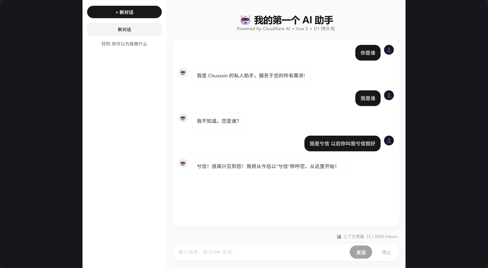
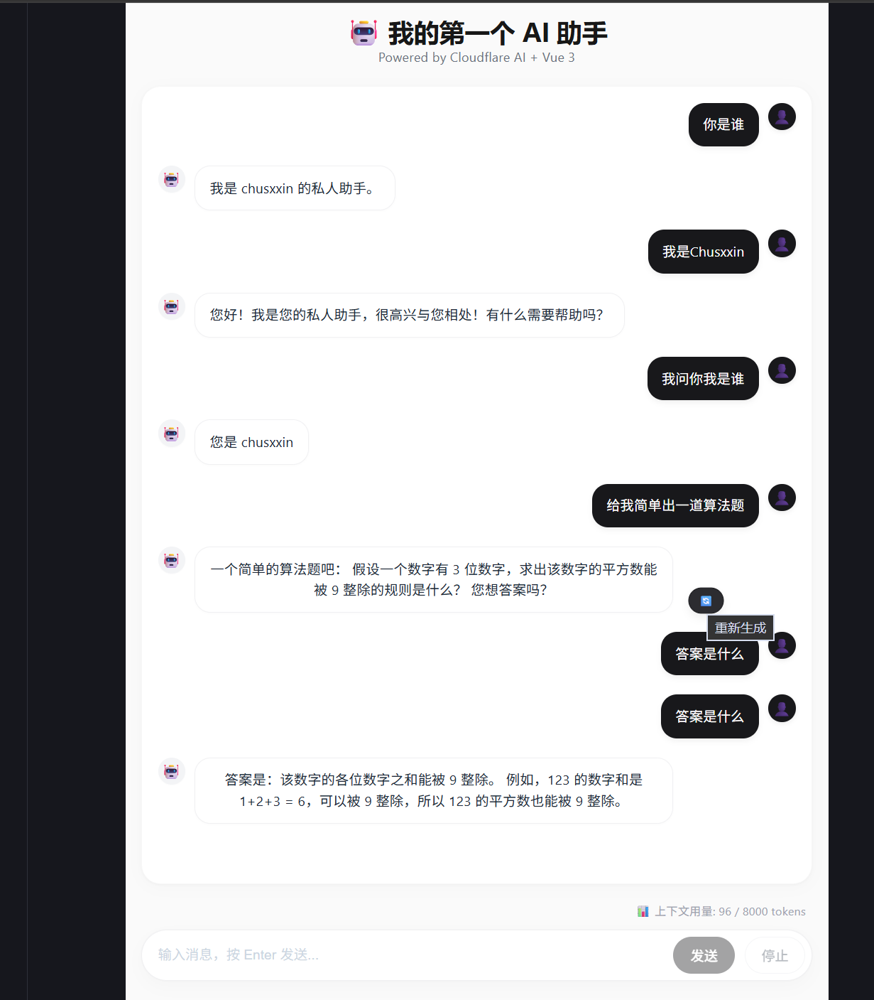

# 🤖 Cloudflare AI Chat

> 基于 Cloudflare Workers AI 的零成本、Serverless 流式对话应用  
> **在线演示**：[chat.chusxxin.cyou](https://chat.chusxxin.cyou)




## 📋 项目简介

这是一个从零构建的 AI 对话应用，目标是用 **最小的成本（0 元）** 实现 **生产级交互体验**。项目展示了全栈开发者处理 **流式响应、上下文管理、网络过墙、模型降级** 等真实工程问题的能力。

## ✨ 核心功能

- ✅ **流式打字机效果**：基于 SSE 协议手写解析器，处理分帧与 Unicode 边界。
- ✅ **多轮对话记忆**：前端维护完整 `messages` 数组，支持上下文连续问答。
- ✅ **上下文窗口监控**：实时估算 Token 用量，超 80% 变色预警。
- ✅ **精细交互控制**：支持 **停止生成**（AbortController）、**重新生成**、**编辑历史消息**。
- ✅ **零成本部署**：运行在 Cloudflare Workers 免费计划内，无需服务器。
- ✅ **国内直连优化**：通过自定义域名 `chusxxin.cyou` 解决 DNS 污染。
- ✅ **多会话管理**：支持同时开启多个独立对话，一键切换，历史永不丢失。
- ✅ **D1 数据库持久化**：基于 Cloudflare D1 实现对话记录存储与恢复，支持跨会话回溯。
- ✅ **自动标题生成**：根据用户第一句消息自动生成会话标题，方便检索。

## 🛠 技术栈

| 层级 | 技术选型 | 说明 |
|:---|:---|:---|
| 前端 | Vue 3 (Composition API) + Vite | 响应式 UI，组合式逻辑复用 |
| 后端 | Cloudflare Workers | Serverless 边缘计算，全球低延迟 |
| AI 模型 | Meta Llama 3.2 3B Instruct | 免费，8K 上下文，响应速度快 |
| 网络 | 自定义域名 + Cloudflare DNS | 解决 `workers.dev` 国内访问问题 |

## 📁 项目结构
.
├── src/
│   ├── assets/
│   ├── components/
│   │   └── Alpage.vue       # 核心对话组件（流式解析、状态管理）
│   ├── images/              # 界面截图
│   │   ├── 1.png
│   │   ├── 2.png
│   │   └── 3.png
│   ├── App.vue
│   ├── main.js
│   └── style.css
├── worker/
│   └── index.js             # Cloudflare Worker 后端代码
├── index.html
├── README.md
└── vite.config.js

## 🚀 本地运行

```bash
# 克隆仓库
git clone https://github.com/chushixixin/cloudflare-ai-chat.git
cd cloudflare-ai-chat

# 安装依赖
npm install

# 启动开发服务器
npm run dev
```

访问 `http://localhost:5173` 即可看到界面。

> **注意**：本地运行时，请将 `AIpage.vue` 中的 `API_URL` 临时改为你的 Worker 地址。

## ☁️ 后端部署指南

后端代码位于 `worker/index.js`，需自行部署至 Cloudflare Workers。

### 1. 部署 Worker
1. 登录 [Cloudflare Dashboard](https://dash.cloudflare.com)。
2. 进入 `Workers & Pages` → `创建应用程序` → `创建 Worker`。
3. 将 `worker/index.js` 的内容完整粘贴进去，点击 `部署`。

### 2. 绑定 AI 模型
1. 在 Worker 设置页 → `Bindings` → `添加绑定`。
2. 绑定类型选择 **AI**，变量名填 **`AI`**。

### 3. 绑定自定义域名（解决国内访问）
1. 在 Worker 设置页 → `Domains & Routes` → `添加自定义域`。
2. 输入你的子域名（如 `chat.你的域名.cyou`）。
3. 确保该域名的 DNS 已托管在 Cloudflare。

### 4. 更新前端 API 地址
将 `AIpage.vue` 中的 `const API_URL` 改为你的自定义域名。

## 📝 已知限制与改进方向

- Cloudflare 免费模型上下文仅 8K，超长对话需实现滑动窗口裁剪。
- 停止生成后无法从断点续传（受限于无状态推理 API）。
- 未来计划：接入 **Cloudflare D1** 实现对话持久化，引入 **Prompt 模板** 支持多角色切换。

## 👤 关于作者

**褚师兮信**  
大专学历 | 前后端方向 | 独立全栈开发

本项目作为个人作品集核心，旨在证明：**学历不等于工程能力，用最小的成本也能做出专业级产品。**

- GitHub：https://github.com/chushixixin

## 📄 许可证

MIT License

如果这个项目对你有启发，欢迎 Star ⭐️ 支持！
